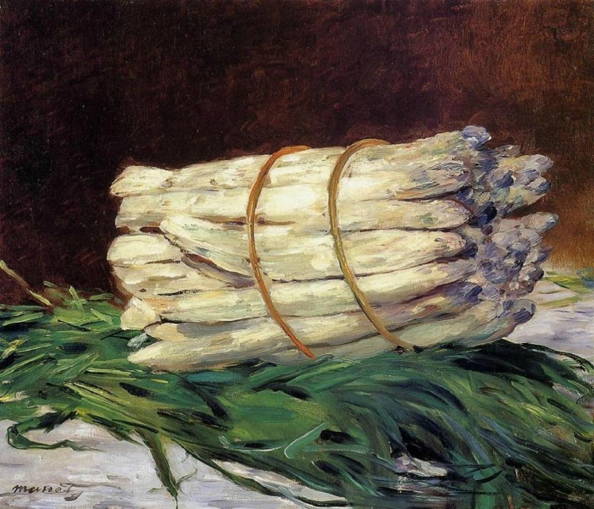

# Asparagus

A crazy Lisp embedded in clojure

See the [tutorial](/src/asparagus/tutorial.clj)

"Je m’arrêtais à voir sur la table, où la fille de cuisine venait de les écosser, les petits pois alignés et nombrés comme des billes vertes dans un jeu ; mais mon ravissement était devant les asperges, trempées d’outre-mer et de rose et dont l’épi, finement pignoché de mauve et d’azur, se dégrade insensiblement jusqu’au pied — encore souillé pourtant du sol de leur plant — par des irisations qui ne sont pas de la terre. Il me semblait que ces nuances célestes trahissaient les délicieuses créatures qui s’étaient amusées à se métamorphoser en légumes et qui, à travers le déguisement de leur chair comestible et ferme, laissaient apercevoir en ces couleurs naissantes d’aurore, en ces ébauches d’arc-en-ciel, en cette extinction de soirs bleus, cette essence précieuse que je reconnaissais encore quand, toute la nuit qui suivait un dîner où j’en avais mangé, elles jouaient, dans leur farces poétiques et grossières comme une féerie de Shakespeare, à changer mon pot de chambre en un vase de parfum."

A la recherche du temps perdu - Marcel Proust .

[traduction](https://edwarddesautels.com/2010/02/14/craft-note-marcel-prousts-asparagus/)
